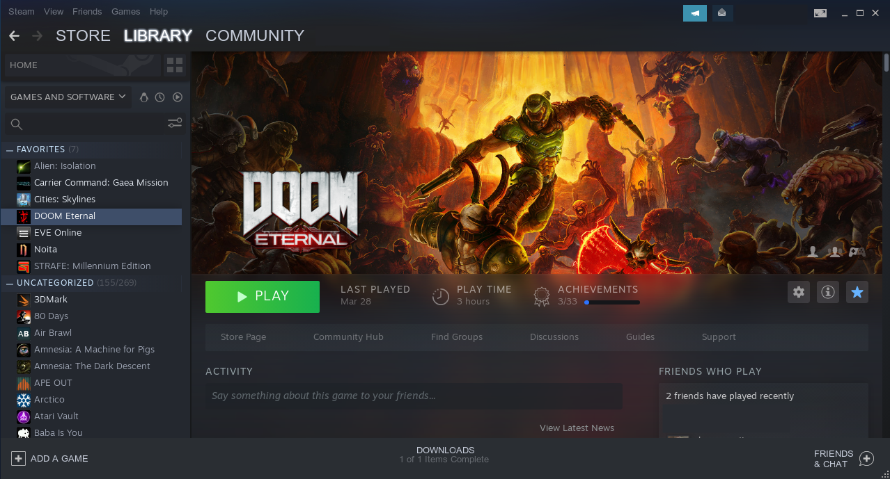
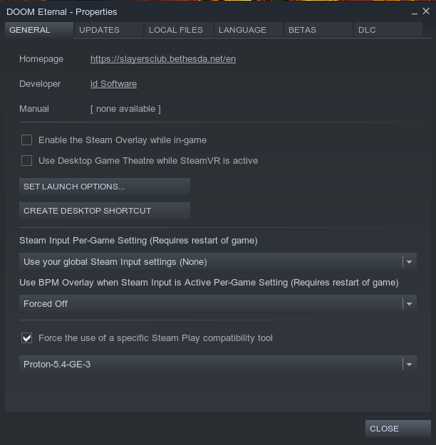

[Home](../index.md)

## DOOM Eternal on gentoo



Doom had problems on NVIDIA graphics cards.

Need [Proton 5.4-GE-3](https://github.com/GloriousEggroll/proton-ge-custom/releases) or higher.

Need [NVidia Drivers 440.66.04](https://developer.nvidia.com/vulkan-driver) or higher.

Need vulkan icd v1.2.135 or higher - get by using [steam beta](https://support.steampowered.com/kb_article.php?ref=7021-eiah-8669).

## Install Proton GE Latest

```bash
wget https://raw.githubusercontent.com/flubberding/ProtonUpdater/master/cproton.sh
chmod a+x cproton.sh
./cproton.sh
```

### Install NVIDIA drivers

```bash
emerge --unmerge nvidia-drivers 
rc-update del xdm
reboot
/home/dragon/Downloads/NVIDIA-Linux-x86_64-440.66.04.run
rc-update add xdm default
rc-config start xdm
```

### Steam Launch Options

```
mangohud RADV_PERFTEST=llvm PROTON_NO_ESYNC=1 %command% +in_terminal 1 +com_skipIntroVideo 1 +com_skipKeyPressOnLoadScreens 1 +com_skipSignInManager 1
```

### Steam options

Turn off steam overlay && BPM overlay
Force use of `Proton-5.4-GE-3` or later.



### Sources

* [Doom Eternal Linux](https://www.christitus.com/doom-eternal-linux)
* [CTT - Doom Eternal on Linux - How to Setup and Game Performance](https://www.youtube.com/watch?v=g3UPxd8iUsU&t=1s)
* [TLG - Here are 3 EASY STEPS to play DOOM ETERNAL on Linux!](https://www.youtube.com/watch?v=u2_Eoqekr9o)
* [krypalkora - Proton 5.4-GE-2 Steam Linux Doom Eternal](https://www.youtube.com/watch?v=cwhoIZcFXLs)
