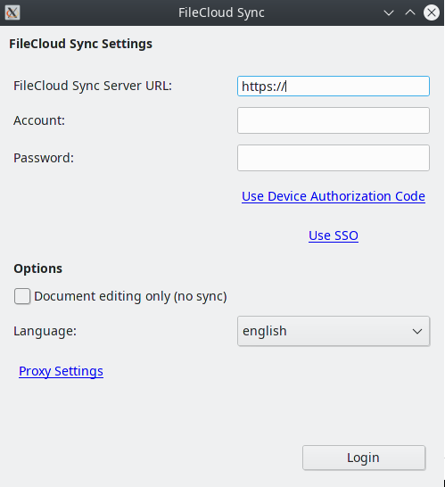
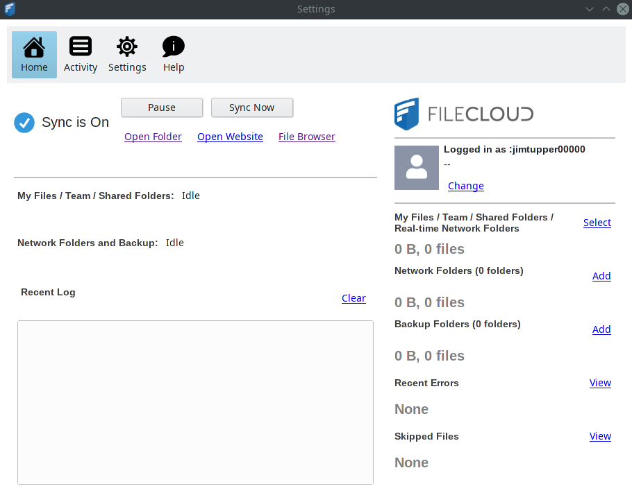

[Home](../index.md)

## FileCloud on Gentoo


Downloading the zip file and unzip (put it in a subfolder, all the files are raw).

[https://www.getfilecloud.com/additional-downloads/](https://www.getfilecloud.com/additional-downloads/#sync)


```bash
  mkdir filecloud
  cd filecloud

  wget https://patch.codelathe.com/tonido/live/installer/x86-linux/filecloudsync_linux_amd64.zip

  unzip filecloudsync_linux_amd64.zip
  chmod u+x filecloudsyncinstall-ubuntu.sh
  ./filecloudsyncinstall-ubuntu.sh

  cd ~/apps/filecloudsync
  ./filecloudsync
```

This fails to start at first due to not being able to find `libjpeg.so.8`. Getting this on gentoo is pretty tricky, I found it in the steam overlay:

```bash
  su -

  layman -a steam-overlay
  echo media-libs/jpeg-compat >>/etc/portage/package.accept_keywords/filecloud
  emerge -av media-libs/jpeg-compat
```

Now this can be started from the normal start menu.





