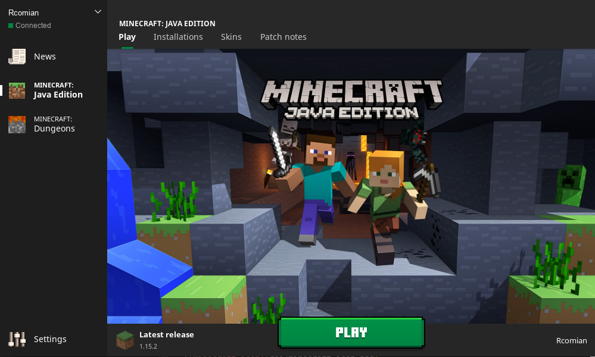
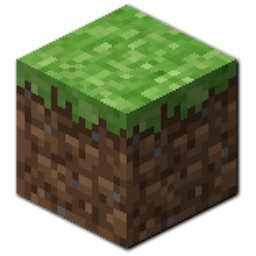

## Minecraft on Gentoo




### Ensure Java JRE is installed

```bash
# As root
emerge -av oracle-jre-bin

# Fails - follow download instructions below

mv -v /home/dragon/Downloads/jre* /var/cache/distfiles/
chown root:root -R /var/cache/distfiles

emerge -av oracle-jre-bin

eselect java-vm set system oracle-jre-bin-1.8

# As user
eselect java-vm set user oracle-jre-bin-1.8
```

Follow instructions to download the correct version from oracle.

__Ensure you download the JRE not the JDK - it's the second set of downloads on the page__

[Java SE Runtime Environment 8 Downloads](https://www.oracle.com/java/technologies/javase-jre8-downloads.html)

[Java SE 8 Archive Downloads](https://www.oracle.com/java/technologies/javase/javase8-archive-downloads.html)

Finish install.

### Get launcher

[Download Launcher](https://launcher.mojang.com/download/Minecraft.tar.gz)

Unzip to Applications folder.

Run with

```bash
~/Applications/minecraft-launcher/minecraft-launcher
```

### Create system launcher

Download icon into applications folder:



Create the following text file:

`~/.local/share/applications/Minecraft.desktop`

```ini
[Desktop Entry]
Comment[en_GB]=
Comment=
Exec=$HOME/Applications/minecraft-launcher/minecraft-launcher
GenericName[en_GB]=
GenericName=
Icon=$HOME/Applications/minecraft-icon.png
MimeType=
Name[en_GB]=Minecraft
Name=Minecraft
NoDisplay=false
Path=$HOME/Applications/minecraft-launcher
StartupNotify=true
Terminal=false
TerminalOptions=
Type=Application
X-DBUS-ServiceName=
X-DBUS-StartupType=
X-KDE-SubstituteUID=false
X-KDE-Username=
```

### Fix the bugs

```
Options
--> Controls
  --> Auto-jump: (OFF)

  --> Mouse Settings
    --> Invert Mouse: (ON)
    --> Raw Input: (OFF)
```
