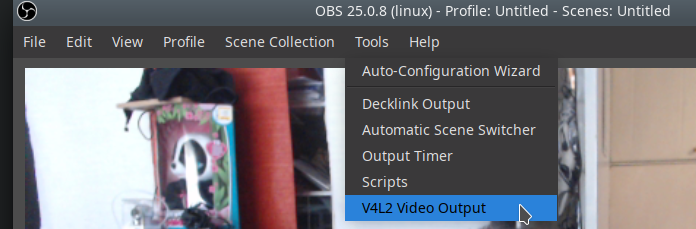
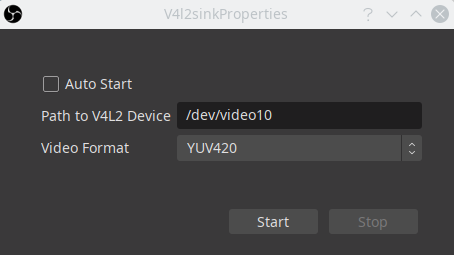
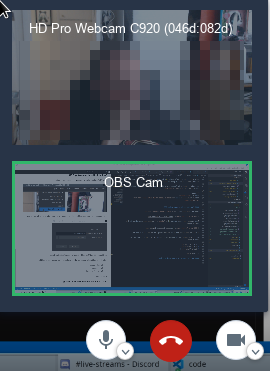

[Home](../index.md)

## OBS Virtual Camera


### Description

Use OBS with its scenes, composition, etc as a webcam source for video chats.

To get this running, first install OBS and get it running normally.

Source: [Linux OBS with WebRTC Video Chat](https://www.patreon.com/posts/linux-obs-with-36762818)

### Process

#### Install v4l2loopback

```bash
emerge -av v4l2loopback
```

This is easy enough, but be warned that as of v12.1 this didn't work with modern kernels, failing on modprobe with an error: `Invalid Address`

This is not a problem with the system or the kernel, it's the package. As of 7/5/2020 the latest git version worked, to install do:

```bash
echo media-libs/v4l2loopback \*\* >>/etc/portage/package.accept_keywords/v4l2loopback
```

Then emerge the package. Once a stable version hits the repository we should use that.

#### Install v4l2sink

This is currently installed from git: https://github.com/CatxFish/obs-v4l2sink

This also depends on qt libraries. These have always been installed for me, if they aren't installed for you, the package qtgui would probably be enough.

To compile the module, you will also need the obs sources.

Make folder to build these things, then:

```bash
git clone --recursive https://github.com/obsproject/obs-studio.git
git clone https://github.com/CatxFish/obs-v4l2sink.git
cd obs-v4l2sink
mkdir build && cd build
cmake -DLIBOBS_INCLUDE_DIR="../../obs-studio/libobs" -DCMAKE_INSTALL_PREFIX=/usr ..
make -j4
```

Once compiled, do not install as suggested. This installs the module in the wrong place for OBS. I don't know why.

Instead, as root:

```bash
cp ./build/v4l2sink.so /usr/lib64/obs-plugins/
```

#### Load the v4l2loopback module

This can be done manually with:

```bash
modprobe v4l2loopback devices=1 video_nr=10 card_label="OBS Cam" exclusive_caps=1
```

This will create a single device (1 is usually enough) named "OBS Cam". This is what you'll select in your video conferencing software.

The module can also be loaded automatically on job start with by adding these lines to `/etc/conf.d/modules`

```bash
modules="v4l2loopback"
module_v4l2loopback_args="devices=1 video_nr=10 card_label='OBS Cam' exclusive_caps=1"
```

#### Publish to the stream using OBS

Open OBS and open the `Tools->V4L2 Video Output` option.



Then choose your video device (the `video_nr` option when modprobing is the device number).



Start the device and OBS will be streaming the output to this device.

Note: This should really appear as a button in the controls section, we should have:

* Start Streaming
* Start Recording
* Start V4L2Loopback

or something

#### Use the camera in video conferencing

In your video confecing app of choice you can now select `OBS Cam` as an option, it will be whatever is being broadcast by OBS, so you can use you full OBS suite a abilities in the video conference.



Note: I have not yet managed to get this working in SkypeForLinux however it works fine for Jitsi.
