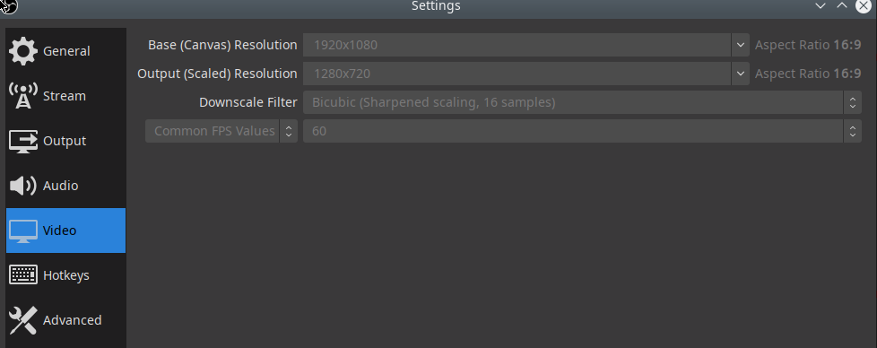
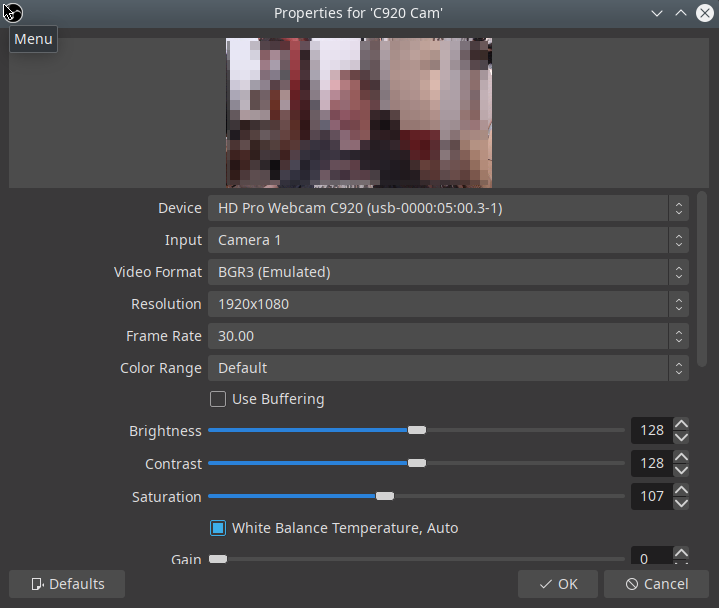

[Home](../index.md)

## OBS Virtual Camera


### Description

Use OBS with its scenes, composition, etc as a webcam source for video chats.

To get this running, first install OBS and get it running normally.

Source: [Linux OBS with WebRTC Video Chat](https://www.patreon.com/posts/linux-obs-with-36762818)

### Process

#### Install v4l2loopback

```bash
emerge -av v4l2loopback
```

This is easy enough, but be warned that as of v12.1 this didn't work with modern kernels, failing on modprobe with an error: `Invalid Address`

This is not a problem with the system or the kernel, it's the package. As of 7/5/2020 the latest git version worked, to install do:

```bash
echo media-libs/v4l2loopback \*\* >>/etc/portage/package.accept_keywords/v4l2loopback
```

Then emerge the package. Once a stable version hits the repository we should use that.

#### Install v4l2sink

This is currently installed from git: https://github.com/CatxFish/obs-v4l2sink

This also depends on qt libraries. These have always been installed for me, if they aren't installed for you, the package qtgui would probably be enough.

To compile the module, you will also need the obs sources.

Make folder to build these things, then:

```bash
git clone --recursive https://github.com/obsproject/obs-studio.git
git clone https://github.com/CatxFish/obs-v4l2sink.git
cd obs-v4l2sink
mkdir build && cd build
cmake -DLIBOBS_INCLUDE_DIR="../../obs-studio/libobs" -DCMAKE_INSTALL_PREFIX=/usr ..
make -j4
```

Once compiled, do not install as suggested. This installs the module in the wrong place for OBS. I don't know why.

Instead, as root:

```bash
cp ./build/v4l2sink.so /usr/lib64/obs-plugins/
```

#### Load the v4l2loopback module

This can be done manually with:

```bash
modprobe v4l2loopback devices=1 video_nr=10 card_label="OBS Cam" exclusive_caps=1
```

This will create a single device (1 is usually enough) named "OBS Cam". This is what you'll select in your video conferencing software.

The module can also be loaded automatically on job start with by adding these lines to `/etc/conf.d/modules`

```bash
modules="v4l2loopback"
module_v4l2loopback_args="devices=1 video_nr=10 card_label='OBS Cam' exclusive_caps=1"
```

#### Publish to the stream using OBS

Open OBS and open the `Tools->V4L2 Video Output` option.


Then choose your video device (the `video_nr` option when modprobing is the device number).


Start the device and OBS will be streaming the output to this device.

Note: This should really appear as a button in the controls section, we should have:

* Start Streaming
* Start Recording
* Start V4L2Loopback

or something

#### Use the camera in video conferencing

In your video confecing app of choice you can now select `OBS Cam` as an option, it will be whatever is being broadcast by OBS, so you can use you full OBS suite a abilities in the video conference.


For Skype & Microsoft Teams, they limit their output to 1280x720, so you need to scale the actual output like so:



#### Logitech C920 Webcam with Linux OBS

There's an issue with OBS using the C920 HD Webcam with linux OBS capture source `Video Capture Device (V4L2)`, by default it offers Video Format `YUYV 4:2:2` as the only native format. Other formats are marked as `(Emulated)`. However, in its native format at 1920x1080, the framerate is limited to 5fps, which is awful.

The camera is perfectly capable of 30fps in 1920x1080 mode. To enable this in OBS choose any of the emulated formats, eg: `BGR3 (Emulated)`. If this doesn't immediately fix the framerate you can choose the full 30fps framerate from the menu below.



#### Audio - pulseaudio routing

Similarly to setting up a video loopback device, we can have an audio loopback device.

Sources:

* https://sysplay.in/blog/linux/2019/06/playing-with-alsa-loopback-devices/
* https://wiki.archlinux.org/index.php/PulseAudio/Examples
* https://www.freedesktop.org/wiki/Software/PulseAudio/Documentation/User/Modules/

##### Mixer device

We can setup a virtual mixer device that receives inputs from various sources:

```bash
pactl load-module module-null-sink sink_name=virt_internal_mixer     sink_properties=device.description=virt_internal_mixer >>./.pamodules
```

##### Optional channels

You can also setup a number of sink devices that applications can play sounds to, eg:

```bash
pactl load-module module-null-sink sink_name=virt_playback_ch1     sink_properties=device.description=virt_playback_ch1 >>./.pamodules
pactl load-module module-null-sink sink_name=virt_playback_ch2     sink_properties=device.description=virt_playback_ch2 >>./.pamodules
```

We need to link the channels to the mixer with a pulseadio loopback device:

```bash
pactl load-module module-loopback latency_msec=5 adjust_time=3 source=virt_playback_ch1.monitor sink=virt_internal_mixer >>./.pamodules
pactl load-module module-loopback latency_msec=5 adjust_time=3 source=virt_playback_ch2.monitor sink=virt_internal_mixer >>./.pamodules
```

##### Virtual microphone for chat apps

We can set up a virtual microphone which can be used by chat applications like Skype, Jitsi and Zoom to transmit the mixed audio to the chatroom.

```bash
pactl load-module module-remap-source master=virt_internal_mixer.monitor master_channel_map=front-left,front-right channel_map=front-right,front-left source_name=virt_broadcast_mic source_properties=device.description=virt_broadcast_mic >>./.pamodules
```

##### Monitoring output

We won't hear our own audio unless we send our mixed audio to a device for monitoring with something like:

```bash
pactl load-module module-loopback latency_msec=5 adjust_time=3 source=virt_internal_mixer.monitor sink=${monitorspeakers} >>./.pamodules
```

We can find the sources to monitor with using:

```bash
pacmd list-sinks | grep -e 'index:' -e device.string -e 'name:'
```

##### Include alsa sources

We can bring in `alsa` sources using the alsa loopback kernel module `snd-aloop`. Remember to modprobe this first if it's not built-in to the kernel.

Configure the kernel setting in:

* Device Drivers
  * Sound card support
    * Advanced Linux Sound Architecture
      * Generic sound devices
        * Generic loopback driver (PCM) = (* or M)

We can now make a loopback device between the alsa loopback device and one of the channels, or perhaps directly to the mixer, with something like:

```bash
pactl load-module module-loopback latency_msec=5 adjust_time=3 source=${alsa}          sink=virt_playback_ch1 >>./.pamodules
```

You can find your alsa loopback device by listing the pulseaudio sources:

```bash
pacmd list-sources | grep -e 'index:' -e device.string -e 'name:'
```

At this point we can set VCV or similar audio software to output to the alsa loopback 1 device (not 0). This will then get routed into our mixed audio as we want.

##### Setup OBS

Now we can use OBS to output to the mixer device or one of the channels. That way broadcast audio can go along with the video.

