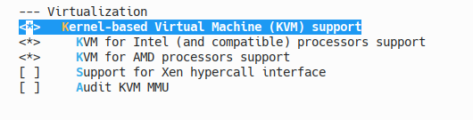
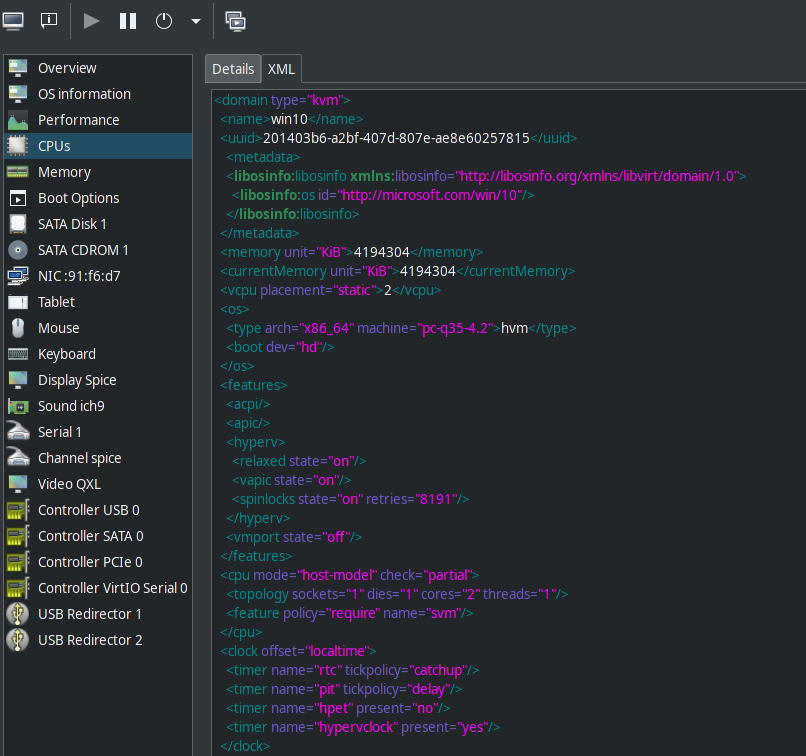
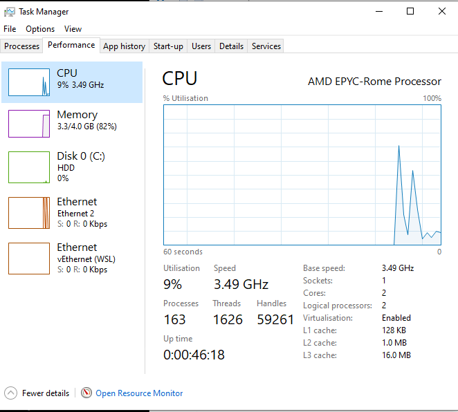

[Home](../index.md)

Virtual Machine Passthrough - QEMU/KVM
================================================


This enables hosted VMs to themselves host VMs. This is needed for linux docker or WSL on windows VMs.

My kernel was set up like this:


```
KVM=y
KVM_INTEL=y
KVM_AMD=y
```

Obviously you only need one of INTEL or AMD selected, but having both didn't hurt my system.

If you choose modules then you need to ensure that they are configured to passthrough the `svm|vmx` options.

You can do this by adding the following into `/etc/modprobe.d/kvm.conf`:
```
options kvm_intel nested=1
options kvm_amd nested=1
```

Ensure that your system has nested kvm enabled like this:
```sh
cat /sys/module/kvm_intel/parameters/nested
cat /sys/module/kvm_amd/parameters/nested
```

If they return `1`(amd) or `Y`(intel) then it's good to go. `0`(amd) or `N`(intel) mean that this configuration hasn't worked.

Once that's in place you need to enable svm|vmx on the virtual machine. This is done by editing the cpu configuration xml like this:



```xml
  <cpu mode="host-model" check="partial">
    <feature policy="require" name="svm"/>
  </cpu>
```

I had to explicitly add the `svm` policy on my AMD chip, although it should be enough to just use `"host-model"` on the CPU.

If your vm guest is a linux machine, you can check that this worked by booting it up and typing the following command:

```sh
cat /proc/cpuinfo | grep -E "svm|vmx"
```

If it returns the appropriate flag in the cpu info then everything worked. If the command shows nothing then your cpu-flags don't contain the virtualisation options and systems requiring accelerated nested virtualisation won't work.

On windows, check CPU info in task manager and look for `Virtualisation: Enabled` on the panel as shown below:



References:

* [How To Enable Nested Virtualization In KVM In Linux](https://ostechnix.com/how-to-enable-nested-virtualization-in-kvm-in-linux/)
* [KVM: Nested Guests](https://www.linux-kvm.org/page/Nested_Guests)
